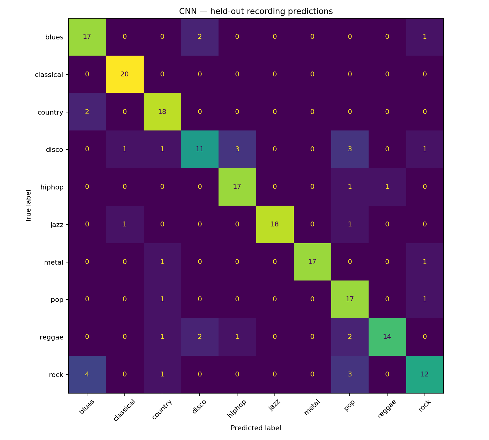
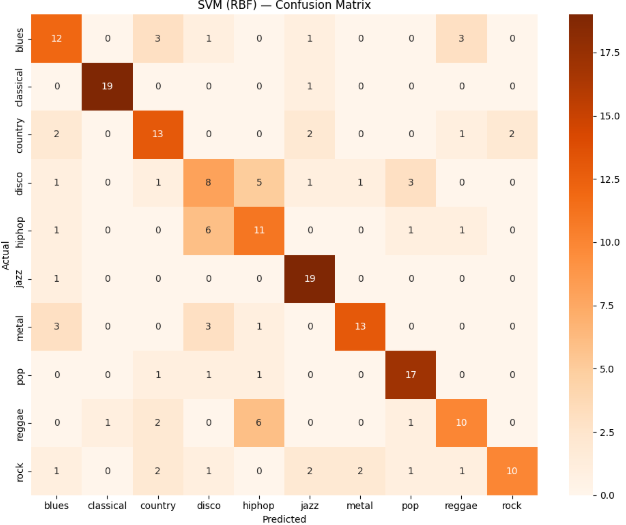

# Audio Genre Classifier 🎵

A machine learning project to classify music genres using signal
processing, classical ML, and a PyTorch CNN on log-mel spectrograms. Includes a FastAPI audio upload app and Docker deployment configuration.

**CNN result:** 81.73% accuracy and 0.8156 macro-F1 on 197 held-out recordings. The trained checkpoint is included in `models/cnn.pt`. Hosting is prepared but a live deployment has not yet been verified.

## Dataset

GTZAN Dataset — 1000 audio clips across 10 genres
(blues, classical, country, disco, hiphop, jazz, metal,
pop, reggae, rock), 30 seconds each.

**Download:** [GTZAN Dataset - Music Genre Classification (Kaggle)](https://www.kaggle.com/datasets/andradaolteanu/gtzan-dataset-music-genre-classification)

The new CNN run uses the [Marsyas GTZAN mirror on Hugging Face](https://huggingface.co/datasets/marsyas/gtzan), also used in Hugging Face’s audio course. The downloaded archive SHA-256 is `b28cc067ff6199bd826f5d1a6931458586d64acae7f44b2e882b7a97af057531`. The source archive contains a `genres` folder; it is equivalent to the `genres_original` folder layout below.

The raw audio files are not included in this repo (see `.gitignore`)
due to their size (~1.2 GB). To reproduce this project:
1. Download the dataset from the Kaggle link above
2. Extract it so the audio files live at `data/genres_original/<genre>/<genre>.000XX.wav`
3. Follow the CNN quick start below, or run notebooks 01–03 for the original classical experiments.

## Approach

### Phase 1 — Signal Processing & Visualization
- Visualized waveforms and spectrograms for all 10 genres
- Compared spectral structure across genres side-by-side to build
  intuition before feature engineering

### Phase 2 — Feature Extraction
Extracted two feature sets using `librosa`:

**Baseline (13 features)**
- MFCC mean (13 features) — timbral texture

**Rich feature set (41 features)**
- MFCC mean + std (26 features) — timbral texture and its variation over time
- Chroma (12 features) — harmonic/pitch content
- Spectral centroid — brightness of sound
- Spectral rolloff — energy distribution
- Zero crossing rate — percussiveness

### Phase 3 — Classical ML Models

| Model | Accuracy |
|-------|----------|
| Random Forest (13 features) | 56% |
| Random Forest (41 features) | 66% |
| Random Forest (GridSearch tuned) | 64% |
| SVM RBF (41 features) | 66% |
| SVM (GridSearch tuned) | **71%** |
| XGBoost (GridSearch tuned) | 63.5% |

**Best classical model: SVM (RBF kernel, C=10, gamma=0.01) — 71% accuracy**

### Phase 4 — CNN on log-mel spectrograms

- Resample to 22,050 Hz mono and use the first 30 seconds.
- Split recordings into 3-second excerpts, each represented by a 64 × 130 log-mel spectrogram.
- Four convolution / batch normalization / pooling blocks, then global pooling and a dense classifier.
- Fixed per-excerpt decibel normalization, training-only time/frequency masking, dropout, AdamW, learning-rate reduction and early stopping.
- **Split entire recordings** into approximately 64% training, 16% validation and 20% test before training. Exact decoded-audio duplicates and corrupt clips are excluded and logged. Excerpts of one recording never cross splits.
- Select the best epoch using validation macro-F1. Average excerpt scores and evaluate the held-out test recordings once after selection.
- Export weights, preprocessing settings, class names, split hash, accuracy, macro-F1, classification report, history and confusion matrix.

The historical 71% SVM result uses a different split and evaluation workflow. It is not a direct comparison with the new CNN. GTZAN also contains repeated content and label problems: this split is not verified artist-disjoint, and exact duplicate removal does not catch every near-duplicate. Do not claim state-of-the-art or that the CNN beats SVM without a controlled comparison.

## Measured CNN result

| Measurement | Result |
|---|---:|
| Held-out recording accuracy | 81.73% |
| Held-out recording macro-F1 | 0.8156 |
| Best epoch (validation macro-F1) | 35 |
| Completed epochs | 35 |
| Training / validation / test recordings | 630 / 158 / 197 |
| Valid distinct recordings | 985 |
| Excluded corrupt / exact duplicate recordings | 1 / 14 |
| Trainable parameters | 164,346 |

Results use seed 42 and recording-level mean excerpt scores. Exact split membership is saved in `models/split_manifest.json`; environment and checkpoint hashes are in `models/run_info.json`. Test recordings did not influence epoch selection. This result is specific to this split and does not establish an improvement over the historical SVM experiment.



## Run the app (Windows, Python 3.12)

Extract the project ZIP. In the folder containing this README, run:

```bat
setup_windows.bat
run_windows.bat
```

Open http://127.0.0.1:7860. The application uses `models/cnn.pt`; you do not need the training dataset to run inference. The first prediction may take longer while audio routines initialize. Read `models/metrics.json` for the measured result.

## Reproduce CNN training

Use notebook `notebooks/04_CNN_spectrogram.ipynb` locally or on a Colab GPU. It uses a separate output folder to preserve the bundled model.

For Windows Command Prompt, after setup:

```bat
.venv\Scripts\python.exe -m genre_cnn.prepare --data "C:\path\to\genres_original"
.venv\Scripts\python.exe -m genre_cnn.train --output runs/cnn-reproduction
```

Replace the quoted path with your actual GTZAN folder containing the ten genres. A CSV feature file alone is not enough. The default training configuration uses two CPU threads, a batch size of 32, and up to 35 epochs with early stopping. No earlier notebook must run first. Use `--checkpoint runs/cnn-reproduction/cnn.pt` for CLI predictions from a new run, or set `MODEL_PATH` before starting the server.

### Optional direct dataset download

If you do not already have GTZAN, `python -m genre_cnn.download_data` downloads and verifies the public archive used in this run. Then use `--data data/genres` when preparing it. Allow about 3 GB of free disk space.

### Equivalent Python commands

```sh
python -m venv .venv
# Activate .venv using your operating system's activation command.
python -m pip install -r requirements-cpu.txt -r requirements-dev.txt
python -m genre_cnn.prepare --data data/genres_original
python -m genre_cnn.train --output runs/cnn-reproduction
python -m genre_cnn.predict path/to/music.wav
python -m uvicorn web.app:app --port 7860
python -m pytest -q
```

For a GPU notebook, use its preinstalled GPU PyTorch and install `requirements.txt`, not `requirements-cpu.txt`. Use a new `--cache` or `--output` directory for intentional new experiments: existing split manifests and checkpoints are protected from overwrites.

The web app validates uploads, processes at most 30 seconds, rejects silence or clips under 3 seconds, and returns ten genre scores. Scores are uncalibrated model preferences. Speech, unseen genres and mixed-genre music may produce misleading predictions. No user audio is retained after its request.

## Deployment

See [DEPLOY.md](DEPLOY.md). The recommended free deployment is a Hugging Face Static Space: audio preprocessing and ONNX inference run locally in the visitor's browser. The FastAPI/Docker version remains available for paid or external server hosting.

## Notes on the original experiments

The observations below describe the historical notebook results. Feature-level explanations are hypotheses rather than causal conclusions from an ablation study.

**What worked well**
- Classical music achieved the highest per-genre accuracy (~95%) —
  its distinct, low-variance timbre separates it clearly from every
  other genre
- Adding MFCC standard deviation (not just mean) captured temporal
  dynamics and improved genres with quiet/loud contrast, like country
- Chroma features drove the biggest jazz improvement — jazz relies on
  complex harmonic progressions that mean-MFCC alone can't capture
- Zero crossing rate successfully separates percussive genres (metal,
  rock) from tonal ones (classical, jazz)

**Where models struggled**
- Rock was consistently the hardest genre to classify — it borrows
  stylistically from metal, country, and jazz, so its feature
  fingerprint is inherently inconsistent
- Both Random Forest and SVM plateaued at 66% on the untuned rich
  feature set, indicating that further controlled feature and model experiments would be useful

**Model comparison**
- **SVM outperformed both Random Forest and XGBoost** after tuning
  (71% vs 64% vs 63.5%). With only ~800 training samples and 41
  features, a max-margin classifier generalizes better than
  tree-based ensembles on this dataset size
- **XGBoost underperformed** and showed the widest gap between
  cross-validation score (67.96%) and test accuracy (63.5%) — a sign
  that its sequential, high-capacity boosting overfits more readily
  than SVM on a dataset this small
- **Random Forest GridSearch tuning made results slightly *worse***
  on the test set (66% → 64%) despite a higher CV score — another
  small-dataset overfitting signal, where CV performance didn't
  transfer perfectly to held-out data

## Tech Stack
Python, PyTorch, librosa, scikit-learn, XGBoost, matplotlib, seaborn, FastAPI, Docker

## Visuals

### Spectrograms by Genre


### Model Performance

**SVM (best model, 71% accuracy)**


**Random Forest (66% accuracy)**


**XGBoost (63.5% accuracy)**

