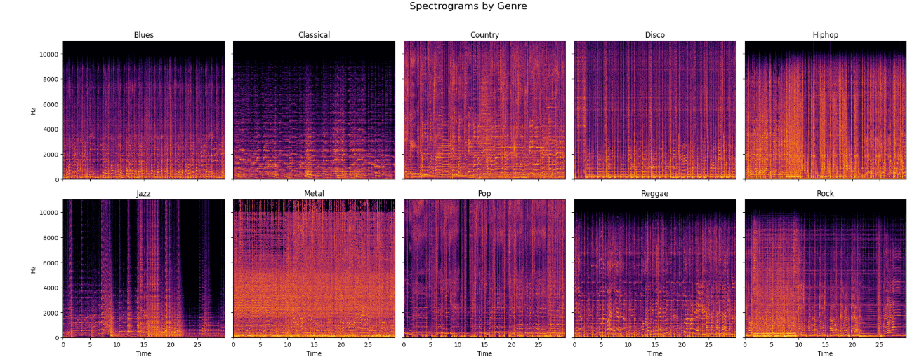
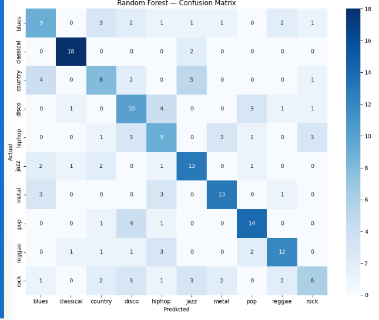
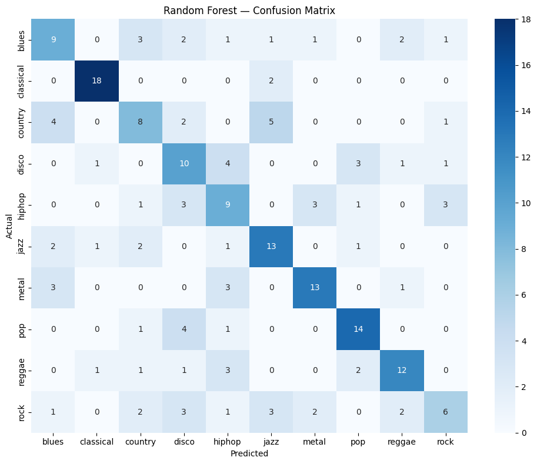

# Audio Genre Classifier 🎵

A machine learning project to classify music genres using signal
processing and classical ML, with a CNN phase in progress.

## Dataset

GTZAN Dataset — 1000 audio clips across 10 genres
(blues, classical, country, disco, hiphop, jazz, metal,
pop, reggae, rock), 30 seconds each.

**Download:** [GTZAN Dataset - Music Genre Classification (Kaggle)](https://www.kaggle.com/datasets/andradaolteanu/gtzan-dataset-music-genre-classification)

The raw audio files are not included in this repo (see `.gitignore`)
due to their size (~1.2 GB). To reproduce this project:
1. Download the dataset from the Kaggle link above
2. Extract it so the audio files live at `data/genres_original/<genre>/<genre>.000XX.wav`
3. Run the notebooks in order (01 → 04)

## Approach

### Phase 1 — Signal Processing & Visualization
- Visualized waveforms and spectrograms for all 10 genres
- Compared spectral structure across genres side-by-side to build
  intuition before feature engineering

### Phase 2 — Feature Extraction
Extracted two feature sets using `librosa`:

**Baseline (13 features)**
- MFCC mean (13 features) — timbral texture

**Rich feature set (41 features)**
- MFCC mean + std (26 features) — timbral texture and its variation over time
- Chroma (12 features) — harmonic/pitch content
- Spectral centroid — brightness of sound
- Spectral rolloff — energy distribution
- Zero crossing rate — percussiveness

### Phase 3 — Classical ML Models

| Model | Accuracy |
|-------|----------|
| Random Forest (13 features) | 56% |
| Random Forest (41 features) | 66% |
| Random Forest (GridSearch tuned) | 64% |
| SVM RBF (41 features) | 66% |
| SVM (GridSearch tuned) | **71%** |
| XGBoost (GridSearch tuned) | 63.5% |

**Best classical model: SVM (RBF kernel, C=10, gamma=0.01) — 71% accuracy**

### Phase 4 — CNN on Spectrograms (in progress)
Next step: move away from handcrafted features and let a CNN learn
directly from spectrogram images, to see if it can break past the
~70% ceiling classical ML hit on this dataset size.

## Key Insights

**What worked well**
- Classical music achieved the highest per-genre accuracy (~95%) —
  its distinct, low-variance timbre separates it clearly from every
  other genre
- Adding MFCC standard deviation (not just mean) captured temporal
  dynamics and improved genres with quiet/loud contrast, like country
- Chroma features drove the biggest jazz improvement — jazz relies on
  complex harmonic progressions that mean-MFCC alone can't capture
- Zero crossing rate successfully separates percussive genres (metal,
  rock) from tonal ones (classical, jazz)

**Where models struggled**
- Rock was consistently the hardest genre to classify — it borrows
  stylistically from metal, country, and jazz, so its feature
  fingerprint is inherently inconsistent
- Both Random Forest and SVM plateaued at 66% on the untuned rich
  feature set, suggesting the ceiling at that point was a **feature
  limitation, not a model limitation**

**Model comparison**
- **SVM outperformed both Random Forest and XGBoost** after tuning
  (71% vs 64% vs 63.5%). With only ~800 training samples and 41
  features, a max-margin classifier generalizes better than
  tree-based ensembles on this dataset size
- **XGBoost underperformed** and showed the widest gap between
  cross-validation score (67.96%) and test accuracy (63.5%) — a sign
  that its sequential, high-capacity boosting overfits more readily
  than SVM on a dataset this small
- **Random Forest GridSearch tuning made results slightly *worse***
  on the test set (66% → 64%) despite a higher CV score — another
  small-dataset overfitting signal, where CV performance didn't
  transfer perfectly to held-out data

## Tech Stack
Python, librosa, scikit-learn, XGBoost, matplotlib, seaborn

## Visuals

### Spectrograms by Genre

### Model Performance

**SVM (best model, 71% accuracy)**

**Random Forest (66% accuracy)**

**XGBoost (63.5% accuracy)**

